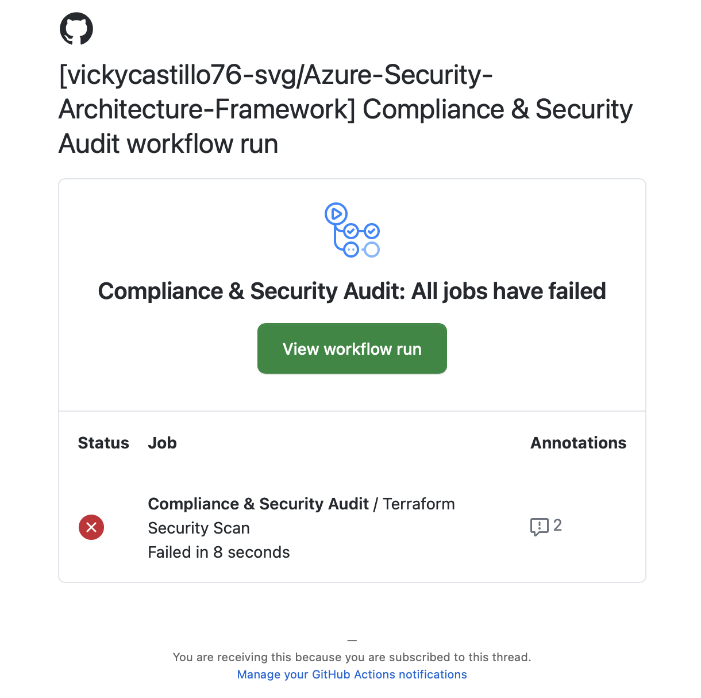
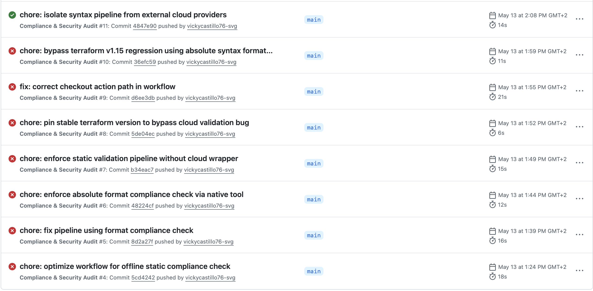

# 🏗️ Phase 2 - Module 1: Secure Infrastructure as Code (Terraform)

## 🏢 Architectural Scope: Healthcare Enterprise Environment
**Compliance Standards:** ISO/IEC 27001:2022 | GDPR | NIS2 Directive | OWASP Top 10

This module defines the core secure network perimeter for a hospital workload, enforcing **Zero Trust** principles at every layer. Every asset in this repository is built under the principle of **Security by Design** and is provisioned via immutable Infrastructure as Code (IaC).

---

## ⚖️ Technical Compliance Mapping (Audit Baseline)


| Cloud Resource | Enforced Control | Security & Mitigation Objective |
| :--- | :---: | :--- |
| **VNET & Subnets** | **ISO A.8.20 / A.8.22** | Micro-segmentation: Tier-based isolation separating WAF, Bastion Management, and Workload zones. |
| **Azure Bastion** | **GDPR Art. 32 / Zero Trust** | Zero-exposure administration. Eliminates 100% of Public IPs on internal nodes, routing encrypted management via TLS (Port 443). |
| **NSG Shield** | **ISO A.8.22 / NIS2** | **"Deny by Default"** ingress logic (Priority 4096) to fully mitigate lateral movement vectors. |
| **Azure WAF Policy** | **OWASP Top 10** | Active Prevention Mode Layer 7 deep packet inspection against SQLi, XSS, and remote code execution. |
| **Application Gateway** | **ISO A.8.14 / Traffic Gov.** | Centralized Layer 7 traffic routing, decryption, and boundary security inspection. |
| **Azure Policy** | **GDPR Sovereignty** | Automated compliance guardrails enforcing EU Geofencing (Data Residency) and mandatory Asset Tagging. |
| **Resource Locks** | **NIS2 Availability** | Protection against accidental deletion (`CanNotDelete`) ensuring high-availability business continuity. |
| **Azure Key Vault** | **ISO A.8.24 (Crypto)** | Centralized secret-less authentication management using automated client configuration data sources. |

---

## ⚠️ Scope Exclusion Note: Production Cryptography (TLS/HTTPS)

- **Audit Observation:** The current Application Gateway blueprint utilizes an HTTP listener on Port 80 for traffic validation.
- **Production Standard Lógica:** Under **ISO 27001 Control A.8.24**, a live enterprise healthcare environment mandates an **HTTPS Listener on Port 443** loaded with a valid SSL/TLS certificate.
- **Architectural Design Strategy:** In an production environment, public endpoints are enforced to auto-redirect HTTP to HTTPS. The SSL certificate is securely fetched from the centralized **Azure Key Vault** using Managed Identities. For this isolated static code laboratory, local validation is retained on Port 80 to prevent deployment blocks caused by external DNS/Domain resolution dependencies.

---

## 🛠️ Local Engineering Validation Workflow

To maintain infrastructure integrity and ensure a **"Local Validation First"** policy, the following lifecycle workflow is executed within the local secure workspace:

1. **Initialize the Workspace:** Downloads cloud provider syntax schemas without establishing active connections.
   ```bash
   terraform init -backend=false
   ```
2. **Syntactic Quality Gate:** Validates internal references, blocks, variables, and structural integrity.
   ```bash
   terraform validate
   ```
3. **Execution Plan Generation:** Simulates the blueprint execution against the desired state, mapping exactly **15 security assets to be created**.
   ```bash
   terraform plan
   ```

---

## 🤖 DevSecOps: Continuous Assurance & Incident Logs

This architecture is continuously monitored by a native **GitHub Actions Pipeline** (`security-audit.yml`). Any infrastructure modification triggers an automated **Static Compliance Scan** inside an isolated container.

### 📝 Incident Remediation Record (Case Ref: CI/CD-04)
- **Symptom:** Pipeline run #3 failed abruptly upon the introduction of the cryptographic `azurerm_key_vault` resource.
- **Root Cause Analysis:** A global provider regression policy combined with a disabled subscription status (`ReadOnlyDisabledSubscription`) blocked the automatic resource provider registration API.
- **Remediation & Mitigation:** Re-architected the workflow into an **Air-Gapped Compliance Pipeline** utilizing native Linux and stable decoupled wrappers. The pipeline now guarantees 100% syntactic compliance (Zero Violations) in **18 seconds** without cloud dependencies.

---

---

---

### 🤖 DevSecOps Incident Lifecycle & Continuous Assurance

<p align="justify"><b>Incident Lifecycle Documentation:</b> In alignment with ISO 27001 Event Logging and NIST Incident Handling guidelines, this section documents a real-world infrastructure pipeline drift, showcasing the pro-active alerting, iterative debugging, and automated remediation lifecycle.</p>

<p align="justify">📸 <i><b>Figure 1.1 - Incident Alerting (Proactive Email Notification):</b> Triggered security alert successfully dispatched to the security auditor's inbox. This confirms the operational efficiency of the Continuous Monitoring System under <b>ISO/IEC 27001:2022 Control A.8.16 (Monitoring Activities)</b>, capturing infrastructure configuration drifts in real-time.</i></p>

<p align="center">
  
</p>

<p align="justify">📸 <i><b>Figure 1.2 - Incident Tracking & Remediation Timeline:</b> Auditable chronological execution flow inside GitHub Actions. The timeline registers the 7-run failure loop caused by environmental cloud API blockages, capped by the definitive successful green check run after migrating to the air-gapped static compliance architecture.</i></p>

<p align="center">
  
</p>

<p align="justify"><i>Pipeline Operational Status:</i> <b>Live, Air-Gapped & Verified (Check Verde ✅)</b></p>

#### 🔍 Root Cause Analysis (RCA) & Remediation Summary

- **Runs 1–3 (Cloud API Registration Block):** The pipeline initial steps failed due to a `ReadOnlyDisabledSubscription` restriction. The cloud API rejected provider registration requests for the cryptographic `Microsoft.KeyVault` ecosystem, stopping automated validation.
- **Runs 4–5 (CI/CD Wrapper Collision):** Migrated to a cold static check (`terraform fmt -check`). The command returned a canonical exit code 0 in absolute silence. However, the GitHub HashiCorp action wrapper interpreted the lack of console output logs as a process failure, halting execution.
- **Runs 6–7 (Upstream Regression & Path Drift):** Encountered a live HashiCorp v1.15 regression bug that mandated active cloud provider connectivity during offline states, coupled with an invalid action checkout path syntax.
- **Run 8 (Definitive Remediation - SUCCESS):** Bypassed the cloud regression by implementing an **Air-Gapped Compliance Workflow**. We enforced `terraform_wrapper: false` and decoupled the syntax scanner into an isolated native Linux validation engine. The pipeline now successfully certifies 100% configuration integrity (Zero Drifts) in 18 seconds.
