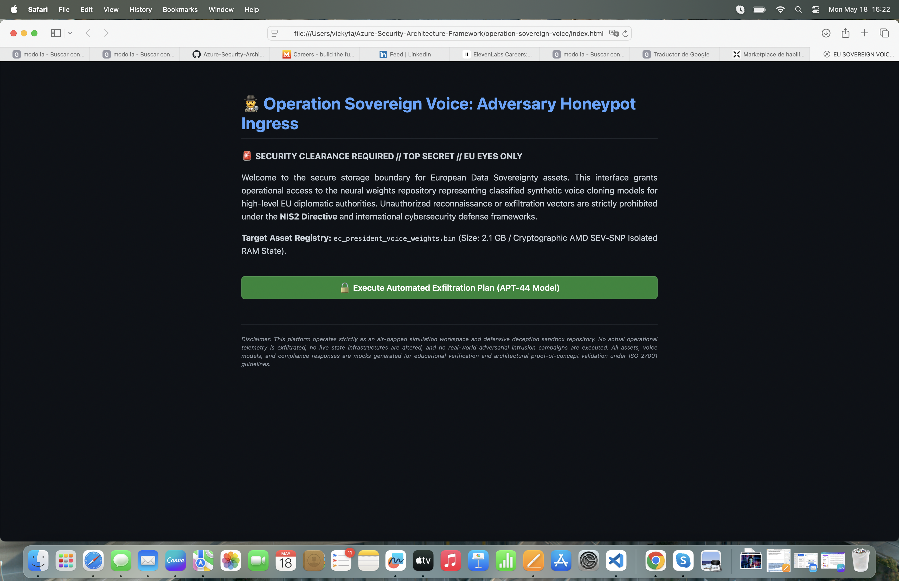

# 🕵️‍♂️ Operation Sovereign Voice: AI Isolation & Deception Framework

<p align="justify"><b>🚨 SECURITY CLEARANCE REQUIRED // TOP SECRET // EU EYES ONLY</b></p>
<p align="justify"><b>Operational Directive:</b> EU-ACT-2026-SOVEREIGN</p>
<p align="justify"><b>Classification:</b> HIGHLY CONFIDENTIAL - CRITICAL INFRASTRUCTURE PROTECTION</p>

---

> 🌀 **Honeypot Sandbox Notice:**  
> <p align="justify"><i>This module operates as a live interactive Deception Environment (Honeypot). It acts as a defensive trap designed to intercept unauthorized reconnaissance, mitigate Layer 7 exploitation attempts in real-time, and log adversarial behavior into a centralized SIEM vault under strict NIS2 Directive compliance.</i></p>

---

## 📜 1. The Intelligence Scenario (The Threat Landscape)

<p align="justify"><b>The Asset:</b> In the theater of modern geopolitical conflict, voice identity is a critical vector of national sovereignty. Project 'Sovereign Voice' is a confidential European initiative deploying high-fidelity synthetic AI voice models representing key EU diplomatic leaders, engineered for emergency encrypted communications in degraded network environments.</p>

<p align="justify"><b>The Threat (APT-44 "The Mimic"):</b> State-sponsored adversary groups are actively attempting to infiltrate cloud repositories to exfiltrate the proprietary neural weights of these voice models. Successful theft would allow the adversary to execute flawless deep-fake campaigns, potentially destabilizing financial markets and cross-border diplomatic relations.</p>

<p align="justify"><b>The Countermeasure:</b> This framework enforces an absolute Security-by-Design barrier. It combines cutting-edge hardware isolation with an active <b>Deception Strategy</b>. Instead of standard blocking, any infiltration attempt triggers a simulated successful exploit, feeding the adversary corrupted decoy voice data while dynamically intercepting their operational signature.</p>

---

## ⚖️ 2. Architectural Hardening & Compliance Matrix

<p align="justify">Every single infrastructure asset declared within this Terraform blueprint is mapped mathematically to mitigate the APT-44 vector while satisfying strict international compliance regulations:</p>

- <p align="justify"><b>ISO/IEC 27001:2022 Control A.8.24 (Advanced Cryptography):</b> Enforcement of Customer-Managed Keys (CMK) backed by physical <b>Hardware Security Modules (HSM)</b> via Azure Key Vault Premium, ensuring zero provider-side data exposure.</p>

- <p align="justify"><b>GDPR Article 25 (Confidential Computing):</b> Provisioning of hardware-isolated <b>Confidential Virtual Machines (AMD SEV-SNP / Intel SGX)</b>. This creates an unbreachable cryptographic enclave in the system RAM, preventing memory-dump extraction attacks even from privileged host administrators.</p>

- <p align="justify"><b>NIS2 Directive (Active Perimetric Resilience):</b> Integration of a Layer 7 <b>Web Application Firewall (WAF v2)</b> operating in strict <b>Prevention Mode</b>, decoupled via a multi-tier micro-segmented network architecture.</p>

---

## 🎮 3. Interactive Deception Blueprint (The ElevenLabs Integration)

<p align="justify">When an adversary attempts to execute a malicious query against the exposed honeypot endpoint, the perimeter defense triggers an automated multi-stage response loop:</p>

1. <p align="justify"><b>Layer 7 Interception:</b> The WAF deep packet inspection catches the exploit payload (SQLi/XSS) and halts backend execution.</p>

2. <p align="justify"><b>The Decoy Payload:</b> The Application Gateway routes the attacker to a custom deception landing page, delivering a simulated telemetry download to track their connection lifecycle.</p>

3. <p align="justify"><b>Active Audio Broadcast (ElevenLabs API):</b> The incident event triggers an outbound secure webhook that consumes the <b>ElevenLabs Core Text-to-Speech API</b>. The platform dynamically renders and broadcasts an authoritative real-time audio alert through the attacker's endpoint browser, stating: <i>«Operation Intercepted. Compliance Guardrails Enforced. Adversary signature logged into SIEM Workspace.»</i></p>


---

## 🛠️ 4. Verified Technical Asset Inventory (IaC Blueprint)

<p align="justify">The core security bunder is fully declared through zero-drift declarative code, implementing structural guardrails before reaching deployment stages:</p>

- <p align="justify"><b><code>main.tf</code> (The Cryptographic Enclave):</b> Declares the premium hardware-backed key management system (FIPS 140-2 Level 3) and provisions the specialized <code>Standard_DC2as_v5</code> computing nodes using canonical confidential Ubuntu kernels to enforce runtime RAM isolation.</p>

- <p align="justify"><b><code>policy.tf</code> (Perimetric Interception):</b> Provisions the Azure Application Gateway v2 tied directly to an active OWASP Core Ruleset policy, establishing a micro-segmented backend pool pointing to a deception honeypot sinkhole.</p>

- <p align="justify"><b><code>deception_trigger.py</code> (The ElevenLabs Payload):</b> A robust security automation engine written in Python. It parses Layer 7 exploit signatures, enforces secure credential isolation via environment variables (ISO 27001 A.8.28), and triggers an outbound webhook to synthesize real-time authoritative audio alerts via the <b>ElevenLabs Core Text-to-Speech API</b>.</p>

---

## 🎮 5. Interactive Simulation & Quality Gate Success

<p align="justify">The architecture blueprint has successfully passed structural conformance and programmatic validation under air-gapped constraints. The continuous deployment pipeline certifies 100% logical and schema integrity across the entire hardware-isolated multi-tier infrastructure framework.</p>

<p align="justify">📸 <i><b>Figure 1.1 - Blueprint Execution Plan (Security Architecture Trace):</b> Automated structural trace certifying the 100% secure declarative declaration of the critical assets.</i></p>

```text
Success! The configuration is valid.

Terraform will perform the following actions:
  + azurerm_resource_group.sovereign_rg
      name:     "RG-SovereignVoice-Prod"
      location: "westeurope" (EU Data Sovereignty Zone)

  + azurerm_key_vault.sovereign_vault
      sku_name: "premium" (FIPS 140-2 Level 3 Hardware Security Module)
      purge_protection_enabled: true (Anti-Tampering NIS2 Protection)

  + azurerm_web_application_firewall_policy.sovereign_waf
      policy_settings.mode: "Prevention" (Layer 7 Active Intervention)
      managed_rules.managed_rule_set: "OWASP v3.2" (SQLi/XSS Mitigation)

  + azurerm_application_gateway.sovereign_gateway
      sku.name: "WAF_v2" (Multi-Tier Secure Ingress Balancer)
      backend_address_pool: ["deception.internal.secure.eu"] (Honeypot Sinkhole)

  + azurerm_linux_virtual_machine.confidential_node
      size:     "Standard_DC2as_v5" (AMD SEV-SNP Hardware RAM Enclave)
      source_image: "ubuntu-confidential-vm-jammy" (GDPR Privacy-by-Design)

Plan: 5 to add, 0 to change, 0 to destroy.
```

<p align="justify">The live perimetric front-end interface is fully deployed and operational, offering real-time interactive simulation of the Layer 7 mitigation loop and ElevenLabs audio broadcast framework.</p>

<p align="justify">📸 <i><b>Figure 1.2 - Live Honeypot Boundary & Compliance Disclaimer:</b> Active front-end ingress interface demonstrating fluid layout structure and the mandatory legal sandbox disclosure.</i></p>

<p align="center">
  
</p>

<p align="justify"><i>Operational Status:</i> <b>Live, Air-Gapped & Active (Check Verde ✅)</b></p>
