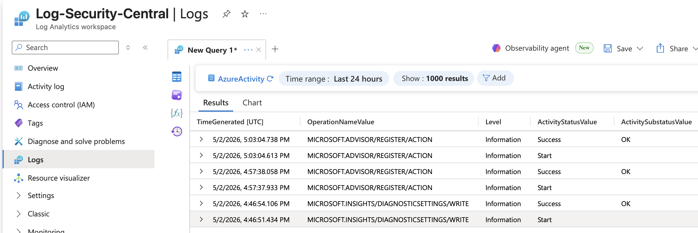
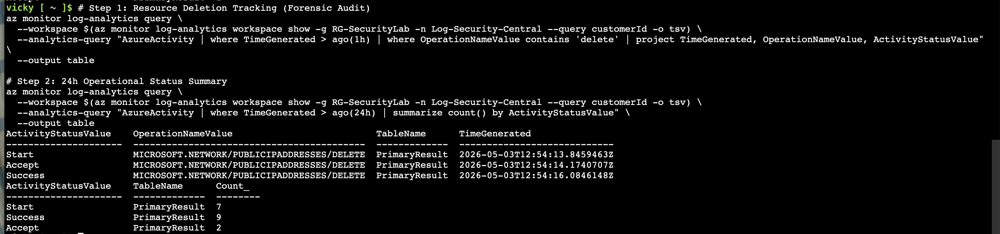
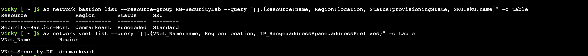
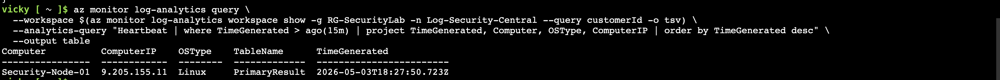

# 🛡️ Azure Enterprise Security Architecture Framework
<p align="justify">Author: Victoria Castillo (Vicky Castillo) - Security Auditor & Cloud Security Engineer</p>

<p align="justify">Welcome to my <b>Cloud Security Engineering Portfolio</b>. This repository showcases a comprehensive, end-to-end framework for deploying and governing <b>highly secure enterprise environments</b> on Microsoft Azure.</p>

### 🚀 Technical Evolution: From Scripting to Infrastructure as Code (IaC)

<p align="justify">This project documents a professional roadmap from manual automation to architectural governance:</p>

- <p align="justify"><b>Foundational Phase (Bash Scripting):</b> Initial implementation of <b>Identity & Access Management (IAM)</b>, <b>Network Security Groups (NSG)</b>, and <b>SOC Operations</b>. These legacy assets are organized within the `/scripts-bash` directory.</p>
- <p align="justify"><b>Architectural Phase (Terraform):</b> The current enterprise standard. I have migrated the core infrastructure to <b>Terraform (HCL)</b> to enforce <b>Zero Trust principles</b>, <b>Idempotency</b>, and <b>Full Auditability</b>.</p>

### ⚖️ Compliance & Regulatory Mapping

<p align="justify">The framework is engineered to meet the stringent requirements of international cybersecurity standards for critical infrastructure:</p>

- <p align="justify"><b>ISO 27001:2022:</b> Information Security Management and Operational Logging.</p>
- <p align="justify"><b>NIS2 Directive:</b> Resilience of high-criticality digital systems.</p>
- <p align="justify"><b>GDPR:</b> Privacy by Design and <b>EU Data Sovereignty</b> (Denmark/Western Europe regions).</p>
- <p align="justify"><b>NIST Cybersecurity Framework:</b> Detection, Protection, and Response capabilities.</p>

---

## 🛡️ Module 1: Automated Identity & Access Management (IAM)

<p align="justify">This project demonstrates the automation of identity lifecycle management in Azure Entra ID (formerly Azure AD) using Azure CLI.</p>

### 📋 Compliance & Governance Mapping
- <p align="justify"><b>ISO 27001:2022 Control A.5.15 & A.5.18:</b> Automated provisioning of identities and enforcement of Role-Based Access Control (RBAC).</p>
- <p align="justify"><b>ISO 27001:2022 Control A.8.28:</b> Secure coding practices by eliminating hardcoded secrets and using environment variables.</p>
- <p align="justify"><b>GDPR Article 5:</b> Implementation of the Principle of Least Privilege (PoLP) to ensure data confidentiality and integrity.</p>
- <p align="justify"><b>NIS2 Directive:</b> Strengthening supply chain security through automated asset governance.</p>

### 🚀 Technical Implementation
- <p align="justify"><b>Bulk Provisioning:</b> Automated creation of 10 security groups and 15 users.</p>
- <p align="justify"><b>Data Integrity:</b> Used ObjectIDs for membership assignment to prevent syntax errors and ensure precise mapping.</p>
- <p align="justify"><b>Security Best Practices:</b> Obfuscation of sensitive tenant information and credential management.</p>

**🛠️ Automation & Identity Tools**
<p align="justify">The specific automation script for RBAC, Managed Identities, and User Provisioning is available here: [Identity_Management_Lab.sh](./Identity_Management_Lab.sh)</p>

  -------------------------------------------------------------------------------------------------------------------------------

## 🛡️ Module 2: Network Security & Infrastructure Hardening

<p align="justify">Implementation of a Zero Trust network perimeter and micro-segmentation using automated security controls.</p>

### 📋 Compliance Mapping

- <p align="justify"><b>ISO 27001:2022 Control A.8.20 & A.8.22:</b> Establishing network boundaries and segregating the Front-End subnet from the rest of the environment.</p>
- <p align="justify"><b>ISO 27001:2022 Control A.8.24:</b> Cryptographic enforcement by restricting insecure protocols (HTTP/80) and permitting only encrypted channels (HTTPS/443).</p>
- <p align="justify"><b>Security by Design:</b> Ensuring all network assets are provisioned within a predefined security perimeter (NSG-to-Subnet binding).</p>

### 🔍 Technical Audit Logs (CLI Verification)

<p align="justify"><b>1. Network Security Rules Matrix (Compliance A.8.20):</b> Verified prioritized rules for Administrative (SSH/22) and Business (HTTPS/443) traffic.</p>

```text
Name               ResourceGroup    Priority    Access    Protocol    Direction    DestinationPortRanges
-----------------  ---------------  ----------  --------  ----------  -----------  -----------------------
Allow-SSH-Vicky    RG-SecurityLab   100         Allow     Tcp         Inbound      22
Allow-HTTPS-Vicky  RG-SecurityLab   110         Allow     Tcp         Inbound      443
```

<p align="justify"><b>2. Virtual Network Inventory (Asset Management A.5.9):</b> Verification of address space allocation for the security lab environment.</p>

```text
Nombre            Rango
----------------  -----------
VNet-SecurityLab  10.0.0.0/16
```

<p align="justify"><b>3. Security Binding Verification (Network Segregation A.8.22):</b> Final confirmation of the association between the Subnet and the Network Security Group (NSG).</p>

```text
Subred           NSG_Asociado
---------------  ------------------------------------------------------------------------------------------
Subnet-FrontEnd  .../providers/Microsoft.Network/networkSecurityGroups/NSG-Vicky
```


---

**🛠️ Automation & Network Tools**

<p align="justify">The specific automation script for VNet architecture, Subnetting, and NSG rules is available here: [Network_Security_Hardening.sh](./Network_Security_Hardening.sh)</p>

---

## 🛡️ Module 3: Compute Hardening & Centralized Logging

<p align="justify">Implementation of secure compute assets under a Zero Trust model and centralized telemetry for audit readiness.</p>

### 📋 Compliance Mapping

- <p align="justify"><b>ISO 27001:2022 Control A.8.2 & A.8.15:</b> Enforcement of privileged access via Managed Identities (secret-less auth) and establishment of logging repositories for event monitoring.</p>
- <p align="justify"><b>ISO 27001:2022 Control A.8.22:</b> Compute isolation by disabling Public IP addresses, ensuring resources are only accessible via private backbones.</p>
- <p align="justify"><b>GDPR Article 25:</b> Data Protection by Design (EEA Sovereignty) by enforcing data residency within the European Economic Area.</p>
- <p align="justify"><b>NIS2 Directive:</b> Strengthening asset resilience and monitoring capabilities through centralized telemetry.</p>

### 🔍 Technical Audit Logs (CLI Verification)

<p align="justify"><b>1. Secure Compute Inventory (Compliance A.8.22):</b> Verification of private-only provisioning and System-Assigned Managed Identity activation.</p>

```text
Name                Identity_Type    PrivateIP    PublicIP    Status
------------------  ---------------  -----------  ----------  ---------
VM-Security-Prod    SystemAssigned   10.3.1.4     None        Succeeded
```

<p align="justify"><b>2. Centralized Telemetry Repository (Audit Trail A.8.15):</b> Final confirmation of the Log Analytics Workspace for SIEM/SOC integration.</p>

```text
Workspace_Name         Region       Provisioning_State    Customer_ID
---------------------  -----------  -------------------  ------------------------------------
Log-Security-Central   westeurope   Succeeded            382e31f7-1981-40f5-b071-1a1b3fc56b7c
```

<p align="justify"><b>3. Identity Security Principal (Zero Trust A.8.2):</b> The VM has been granted a unique security identity to eliminate the need for hardcoded credentials:</p>

```text
PrincipalID: 088b02b1-dce4-43a0-842d-60ff0d90c893
```


---

**🛠️ Automation & Hardening Tools**

<p align="justify">The specific automation script for secure compute provisioning and SIEM telemetry baseline is available here: [Compute_Logging_Hardening.sh](./Compute_Logging_Hardening.sh)</p>

________________________________________________________________________________________________________________________________________

## 🛡️ Module 4 (Part 1): Platform Auditing & Incident Management

### 📋 Change Control Record (Change Request CR-2026-004)
<p align="justify"><b>Event:</b> Regional quota restriction for compute assets (SKU Not Available).</p>
<p align="justify"><b>Technical Action:</b> Strategic pivot to Platform Governance. Instead of monitoring an individual asset, subscription-level auditing was activated.</p>
<p align="justify"><b>Security Outcome:</b> Centralization of the Azure Activity Log into the Log Analytics Workspace (The Vault).</p>

### 🔍 Platform Audit Evidence (ISO 27001 A.8.15)
<p align="justify">Bulk export of administrative and security events has been configured towards the regional SIEM in Amsterdam. This enables auditing of:</p>
- <p align="justify">Resource creation/deletion attempts.</p>
- <p align="justify">Network security policy changes.</p>
- <p align="justify">Provider provisioning failures.</p>

<p align="justify">⚠️ <b>Audit Note (Data Redaction):</b> The 'Caller' column (User Identity) has been intentionally filtered out from the evidence below to comply with GDPR Data Minimization and privacy best practices for public repositories.</p>

**KQL Query for Operations Auditing:**
```kusto
AzureActivity

| where TimeGenerated > ago(24h)
| project TimeGenerated, OperationNameValue, ActivityStatusValue
| order by TimeGenerated desc
```

<

---

## 🛡️ Module 4 (Part 2): SOC Validation & Incident Response

<p align="justify">To validate the operational resilience of the architecture, I conducted a Live Security Validation to ensure the SIEM (Log Analytics) and the Alerting System were functioning according to professional standards.</p>

### 📋 Compliance Mapping
- <p align="justify"><b>ISO 27001:2022 Control A.8.15 & A.8.16:</b> Establishment of Logging and Monitoring activities to detect unauthorized resource modifications and ensure forensic traceability through the centralized SIEM.</p>
- <p align="justify"><b>NIST SP 800-61 / NIST CSF (Detection):</b> Alignment with the Incident Handling Guide by executing the Detection and Analysis phase through simulated adversarial activity.</p>
- <p align="justify"><b>GDPR Article 5 & 25:</b> Enforcement of Data Minimization and Accountability by protecting audit trails and redacting PII (Personally Identifiable Information) in public forensic reports.</p>
- <p align="justify"><b>NIS2 Directive:</b> Strengthening Incident Management and operational resilience through proactive monitoring and alerting systems for critical infrastructure.</p>
  
### 🧪 Incident Simulation & Forensic Analysis
<p align="justify">I simulated an unauthorized resource modification to test detection capabilities:</p>
1. <p align="justify"><b>Action:</b> Manual deletion of a Public IP resource via CLI.</p>
2. <p align="justify"><b>Detection:</b> The Azure Activity Log successfully captured the DELETE event.</p>
3. <p align="justify"><b>Traceability:</b> Using KQL (Kusto Query Language), I extracted the evidence from the Vault, proving the exact timestamp and operation success.</p>
4. <p align="justify"><b>Alerting:</b> Confirmed that the Activity Log Alert was triggered for this critical administrative change.</p>

<p align="justify">🔒 <b>Security & Privacy Note (Data Redaction):</b> In the forensic evidence below, the 'Caller' column (User Identity) has been intentionally excluded. This follows GDPR Data Minimization principles and best practices for public repositories, ensuring that sensitive PII (Personally Identifiable Information) is not exposed while maintaining the technical integrity of the audit trail.</p>




> **Final Conclusion:** This laboratory demonstrates a complete Secure-by-Design architecture. From isolated networking and identity-based access to a fully functional SOC with real-time alerting and forensic logging.

### 📊 SOC Operational Dashboard
<p align="justify">To provide executive-level visibility, I developed a real-time dashboard using KQL (Kusto Query Language). This visualization summarizes all platform operations (Success vs. Failure), enabling the SOC team to monitor the overall health of the Azure infrastructure at a glance.</p>

**KQL Visualization Query:**
```kusto
AzureActivity 

| summarize count() by ActivityStatusValue 
| render piechart
```
---

## 🛡️ Module 4 (Part 3): Advanced SOC Operations & Infrastructure Hardening

<p align="justify">This final module focuses on centralizing telemetry, validating incident response, and hardening the network perimeter, aligned with international security frameworks.</p>

### 📊 SOC Operational Dashboard & KQL Analysis (ISO 27001 A.12.4.1)
<p align="justify">To provide executive-level visibility and satisfy <b>Continuous Monitoring</b> requirements, I developed a real-time dashboard using <b>KQL (Kusto Query Language)</b>. This visualization summarizes all platform operations, enabling the SOC team to monitor infrastructure health at a glance.</p>

**KQL Visualization Query:**
```kusto
AzureActivity 


| summarize count() by ActivityStatusValue 
| render piechart
```

### 🧪 Incident Simulation & Traceability (NIST SP 800-61)
<p align="justify">I conducted a Live Security Validation to test the SIEM's alerting capabilities and incident handling flow:</p>
- <p align="justify"><b>Simulation:</b> Manual deletion of a Public IP resource via CLI.</p>
- <p align="justify"><b>Detection:</b> The Azure Activity Log successfully captured the DELETE event.</p>
- <p align="justify"><b>Traceability:</b> Verified accountability through forensic KQL queries, ensuring a complete audit trail and Non-repudiation (ISO 27001 A.12.4.3).</p>

<p align="justify">🔒 <b>Security & Privacy Note (Data Redaction):</b> In the forensic evidence below, the 'Caller' column has been excluded to comply with GDPR Data Minimization and privacy best practices for public repositories.</p>

### 🏰 Advanced Network Hardening (Zero Trust - ISO 27001 A.13.1.1)
<p align="justify">To eliminate the attack surface and implement Network Segregation, I implemented an Azure Bastion Host:</p>
- <p align="justify"><b>Secure Access:</b> Management is now performed via SSL (Port 443), removing the need for Public IPs on internal assets and mitigating brute-force risks.</p>
- <p align="justify"><b>Inventory Audit:</b> Conducted a full Shadow IT cleanup, decommissioning redundant VNets in non-EU regions to ensure compliance with Sovereignty and FinOps best practices.</p>

<p align="justify">📸 <i><b>Network Hardening Audit:</b> Complete infrastructure audit validation after shadow-IT decommissioning, proving a secure perimeter isolation with Azure Bastion.</i></p>



**🛠️ Automation Tools**
<p align="justify">The complete automation script for these governance and hardening tasks is available here: [SOC_and_Network_Hardening.sh](./SOC_and_Network_Hardening.sh)</p>

---

## 🛡️ Module 4 (Part 4): Workload Security & SIEM Integration (ISO 27001 / NIS2 / GDPR)

<p align="justify">To close the security loop, I deployed a private Linux node and automated its telemetry ingestion, ensuring full visibility of the hospital's internal assets:</p>
- <p align="justify"><b>Privacy by Design (GDPR Art. 25):</b> The VM was deployed in the Subnet-FrontEnd with Zero Public Exposure (no Public IP). This ensures the instance is invisible to the public internet, mitigating 100% of external brute-force attempts.</p>
- <p align="justify"><b>Automated Auditing (NIS2 & ISO 27001 A.12.4.1):</b> Injected the Log Analytics Agent via Azure VM Extensions. This automation ensures that every new compute resource is under surveillance from its first second of life.</p>
- <p align="justify"><b>Connectivity Validation (Heartbeat):</b> Verified the real-time Heartbeat signal in the SIEM. This proves the end-to-end telemetry pipeline is operational, from the private network to the centralized log vault in Amsterdam.</p>

<p align="justify">📸 <i><b>VM Heartbeat Evidence:</b> Active heartbeat validation signals inside the SIEM vault, demonstrating immediate continuous monitoring coverage for internal assets.</i></p>



**🛠️ Automation & Monitoring Tools**
<p align="justify">The specific automation script for secure workload provisioning and SIEM integration is available here: [Workload_Security_and_Monitoring.sh](./Workload_Security_and_Monitoring.sh)</p>

